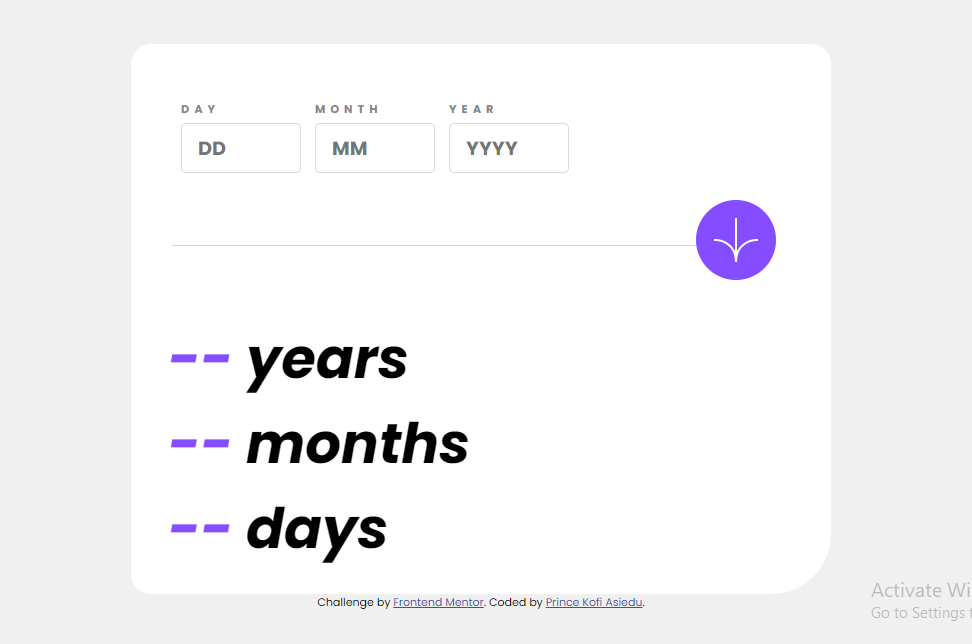

# Frontend Mentor - Age calculator app

## Got feedback for me?

We love receiving feedback! We're always looking to improve our challenges and our platform. So if you have anything you'd like to mention, please email hi[at]frontendmentor[dot]io.

This challenge is completely free. Please share it with anyone who will find it useful for practice.

**Have fun building!** 🚀


---------------------------------------------------------

# Frontend Mentor - Age calculator app solution

This is a solution to the [Age calculator app challenge on Frontend Mentor](https://www.frontendmentor.io/challenges/age-calculator-app-dF9DFFpj-Q). Frontend Mentor challenges help you improve your coding skills by building realistic projects. 

## Table of contents

- [Overview](#overview)
  - [The challenge](#the-challenge)
  - [Screenshot](#screenshot)
  - [Links](#links)
- [My process](#my-process)
  - [Built with](#built-with)
  - [What I learned](#what-i-learned)
  - [Continued development](#continued-development)
  - [Useful resources](#useful-resources)
- [Author](#author)
- [Acknowledgments](#acknowledgments)

## Overview

### The challenge

Users should be able to:

- View an age in years, months, and days after submitting a valid date through the form
- Receive validation errors if:
  - Any field is empty when the form is submitted
  - The day number is not between 1-31
  - The month number is not between 1-12
  - The year is in the future
  - The date is invalid e.g. 31/04/1991 (there are 30 days in April)
- View the optimal layout for the interface depending on their device's screen size
- See hover and focus states for all interactive elements on the page
- **Bonus**: See the age numbers animate to their final number when the form is submitted

### Screenshot



### Links

- Solution URL: [Asiedu13/my-age](https://github.com/Asiedu13/my-age)
- Live Site URL: [my-age-beta.vercel.app](https://my-age-beta.vercel.app/)


### Built with

- Semantic HTML5 markup
- CSS custom properties
- Flexbox
- Mobile-first workflow
- [Styled Components](https://styled-components.com/) - For styles
### What I learned

With this, I learnt about the font-face and how to import downloaded fonts into the project.

```css
@font-face {
  font-family: poppins_regular;
    src: url(../fonts/Poppins-Regular.ttf);
}
```
I relied heavily on the concept of flexbox for this project.

Also, I discovered ways to find the number of years from a millisecond form of the difference between birth and current date
 
```js
  function findYear (mSeconds) {
    var checkYear = Math.floor(mSeconds / 31536000000);
    console.log(checkYear)
  }

  function convertmili( mSeconds ){
    var one_day=1000*60*60*24
    let days = Math.floor(mSeconds / one_day);
    return days;
}


```
Moreover, I applied functional programming paradigm as this helps make the code easier to understand and debug.

For this project, I used the (successful git model)[https://nvie.com/posts/a-successful-git-branching-model/] by Vincent Driessen for versioning of the project. 

### Continued development

Moving forwards, I would focus on css grid and have a firm grip of the Javascript data types and their common methods.


### Useful resources
- (The Successful git model)[https://nvie.com/posts/a-successful-git-branching-model/] by Vincent Driessen - This helped me with code versioning. I really liked this pattern and will use it going forward.

- (Color Picker )[https://colorpicker.fr/] - This is an amazing tool for identifying colors in various formats. I'd recommend it to anyone who would like to clone a product.

## Author

- Website - [Prince Kofi Asiedu](https://asiedu13.github.io)
- Frontend Mentor - [@Asiedu13](https://www.frontendmentor.io/profile/Asiedu13)
- Twitter - [@Prince_KAsiedu](https://www.twitter.com/Prince_KAsiedu)


## Acknowledgments

I would like to thank my roommates, Nana Kwame Oduro-Marfo and Mark Korankye for their support during development of this project.
